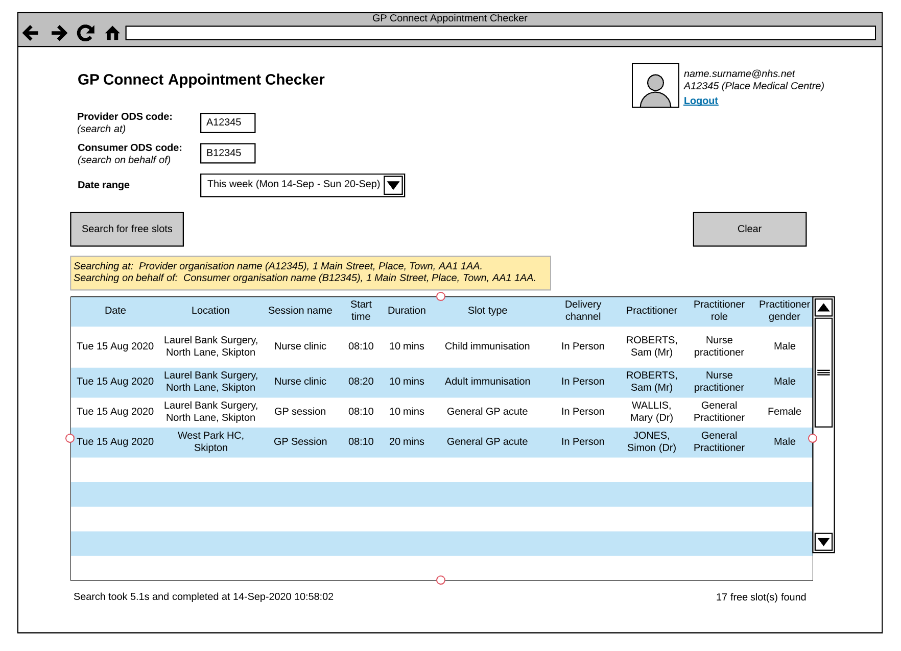
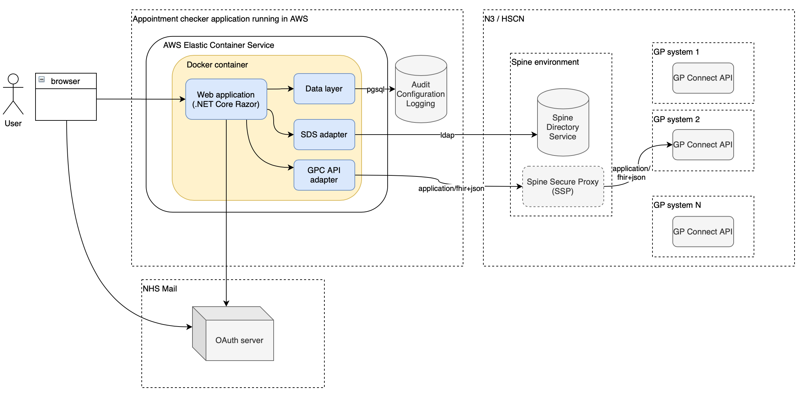
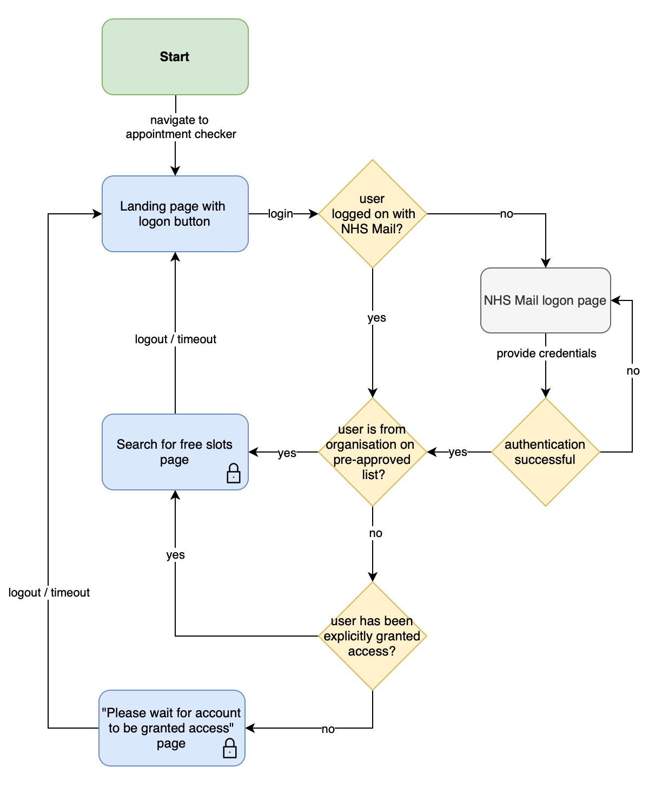

# GP Connect Appointment Checker

The GP Connect Appointment Checker is a web application for GP Connect operational support staff to remotely support GP practices in configuring their appointment book to receive bookings via GP Connect API.



## Tech stack

  - .NET Core 3.1
    - ASP.NET
  - Docker
  - Postgresql 12
    - Stored functions, npgsql & dapper
    - Flyway
  - NHS UK frontend
  - NHS Mail authentication
  - Built according to progressive enhancement

## High level architecture



## User flow



## Build status

[](https://github.com/nhsconnect/gpconnect-appointment-checker/actions)

## Build and run

Create a blank database in postgres, then build and run the docker database image to patch your blank database, replacing the `PG_` variables with your postgres database connection details:

```
cd database
docker build -t gpconnect-appointment-checker-database .
docker run --rm gpconnect-appointment-checker-database -url=jdbc:postgresql://PG_HOST/PG_DBNAME -user=PG_USER -password=PG_PASS migrate
```

Then build and run the docker application image as follows, replacing the `PG_` variables with your postgres database connection details:

```
cd source
docker build -t gpconnect-appointment-checker .
docker run -d -p 8000:80 -e "ConnectionStrings:DefaultConnection=Server=PG_HOST;Port=PG_PORT;Database=PG_DBNAME;User Id=PG_USERID;Password=PG_PASS" --name gpconnect-appointment-checker gpconnect-appointment-checker
```

## Test

TBC

## Links

- [GP Connect API 1.2.7](https://developer.nhs.uk/apis/gpconnect-1-2-7/)
  - GP connect API calls
    - [Search for free slots](https://developer.nhs.uk/apis/gpconnect-1-2-7/appointments_use_case_search_for_free_slots.html)
    - [Get the FHIR capability statement](https://developer.nhs.uk/apis/gpconnect-1-2-7/foundations_use_case_get_the_fhir_capability_statement.html)
  - Spine integration
    - [Overview](https://developer.nhs.uk/apis/gpconnect-1-2-7/integration_illustrated.html)
    - [Creating the audit JWT](https://developer.nhs.uk/apis/gpconnect-1-2-7/integration_cross_organisation_audit_and_provenance.html)
    - [Spine Directory Service (SDS)](https://developer.nhs.uk/apis/gpconnect-1-2-7/integration_spine_directory_service.html)
    - [Spine Secure Proxy (SSP)](https://developer.nhs.uk/apis/gpconnect-1-2-7/integration_spine_secure_proxy.html)
- [NHS Mail sign sign on integration guide](https://s3-eu-west-1.amazonaws.com/comms-mat/Comms-Archive/NHSmail+Single+Sign-on+Technical+Guidance.pdf)
- [NHS UK frontend](https://github.com/nhsuk/nhsuk-frontend)
- [GOV.UK service manual - technology](https://www.gov.uk/service-manual/technology)
  - [Progressive enhancement](https://www.gov.uk/service-manual/technology/using-progressive-enhancement)
