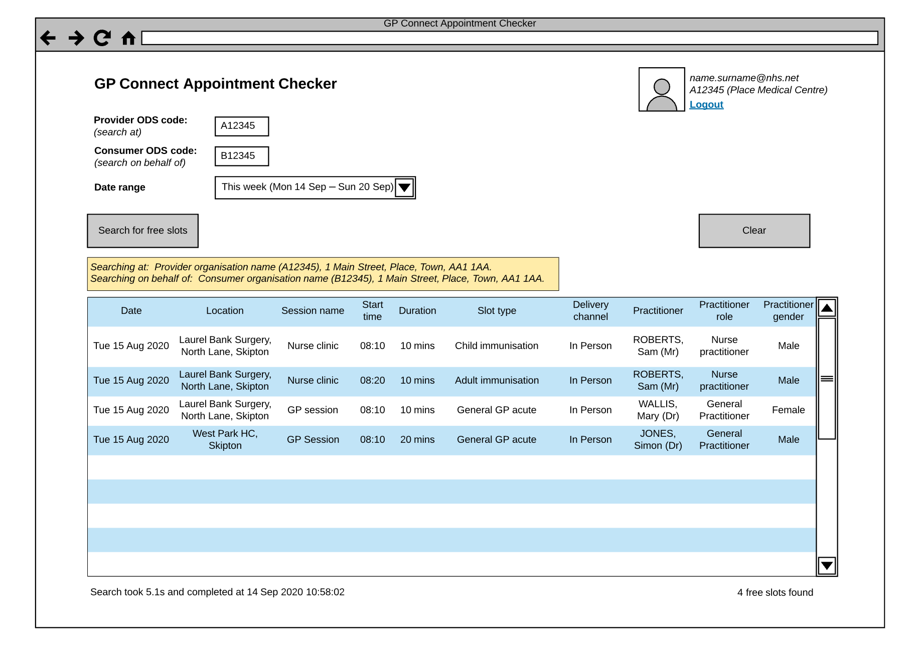

# GP Connect Appointment Checker

The GP Connect Appointment Checker is a web application for GP Connect operational support staff to remotely support GP practices in configuring their appointment book to receive bookings via GP Connect API.



## Tech stack

  - C# / .NET 5.0
    - ASP.NET
  - Docker
  - Postgresql 12
    - Stored functions, npgsql & dapper
    - Flyway
  - NHS UK frontend
  - NHS Mail authentication
  - Built according to progressive enhancement

## High level architecture


## User flow


## Build status

[](https://github.com/nhsconnect/gpconnect-appointment-checker/actions)

## Build and run locally

#### Software Requirements

- PostgreSQL
- PG Admin (or another database management system for postgres)
- Docker
- Docker Desktop

### MacOS Setup Pre-Requisites

- If you're using Postgres.App to run Postgres you will need to configure the following:
  - Modify postgresql.conf - (found within Postgres.App → Server Settings → Config File → Show) and open in text editor
  - Find this line:

```
listen_addresses = 'localhost'
```

Change it to:

```
listen_addresses = '*'
```

This will allow Docker to speak to the Postgres host, if you don't wish to open to all IP ranges you can modify to specific host IP of docker.

### Step 1: Create a Local Database

Open PG Admin and create a new local database called gpcac . You can use the following command or the user interface, whichever you prefer:

```postgresql
CREATE DATABASE gpcac;
```

### Step 2: Create a Database Migration Image

You'll need to create the docker image for the dbpatcher by:

- Navigating to the `./database` folder
- Running the following command

```
docker build -t gpconnect-appointment-checker-dbpatcher .
```

You can confirm that the image created successfully using Docker Desktop by going to the images tab and then checking to see if the image is listed


### Step 3: Run Migration Scripts

You will need to run the migration scripts contained in the image we just created, against the local database you created in order to set up the database and migrate to the most recent schemas. You can do so by running the following command:

```
docker run --rm --network="host" gpconnect-appointment-checker-dbpatcher -user=<POSTGRES USERNAME> -password=<POSTGRES PASSWORD> -url=jdbc:postgresql://localhost:5432/gpcac -locations=filesystem:sql,filesystem:sql-tests migrate
```

You should see the following message if the migration is completed successfully:

```
Successfully applied 125 migrations to schema "public", now at version v6.8 (execution time 00:02.221s)
```
<br>

> ⚠️ **When running on MacOs** ⚠️ - if you see an error about connection refused, check you followed the MacOs setup above. If this has been done you may need further configuration on your Postgres settings to authorise docker to communicate with local Postgresql server. You may need to add the following to your `pg_hba.conf` file
> 
> ```
> host    all             all             192.168.65.0/24         scram-sha-256
> ```
> Which authorises 192.168.65.0/24 subnet to access the postgres server (as long as correct password and username is provided). If this still doesn't work, make sure your docker containers are running on that subnet, you can do this by running the following command:
> ```
> docker run --rm alpine nslookup host.docker.internal
> ```
> which should output something like:
> ```
> Server:         192.168.65.7
> Address:        192.168.65.7:53
> 
> Non-authoritative answer:
> Name:   host.docker.internal
> Address: 192.168.65.254
> 
> Non-authoritative answer:
> Name:   host.docker.internal
> Address: fdc4:f303:9324::254
> ```
> Which tells us our docker container runs on **192.168.65.7**

### Step 4: Validate Migration is Successful

In order to validate that the migration was successful you can run the following query against your gpcac  database via the terminal or preferred IDE and check the result.

```postgresql
SELECT * FROM configuration.get_general_configuration();
```
You should see table like below:

| product_name                   | product_version | max_num_weeks_search | log_retention_days | get_access_email_address | max_number_provider_codes_search | max_number_consumer_codes_search |
|:-------------------------------|-----------------|----------------------|--------------------|--------------------------|----------------------------------|----------------------------------|
| GP Connect Appointment Checker | 1.0.0           | 12                   | 365                | testemail@test.uk        | 20                               | 20                               |
| (1 row)                        |


### Step 5: Add User to Local Database

You will need to add your nhs.net account details to the local database in order to pass through authentication when running the application locally. You can do so by running the following query against your local gpcac  database, switching the placeholder text with your credentials.

```postgresql
INSERT INTO application."user"
(
    email_address,
    display_name,
    organisation_id,
    added_date,
    authorised_date,
    last_logon_date,
    is_admin,
    multi_search_enabled,
    terms_and_conditions_accepted,
    user_account_status_id,
    org_type_search_enabled
)
VALUES (
    '<YOUR NHS.NET EMAIL ADDRESS>',
    '<YOUR FULL NAME>',
    2,
    NOW(),
    NOW(),
    null,
    true,
    true,
    null,
    2,
    true
);

```
You can verify that your user was added by using the following query and checking to ensure the user you just created exists on the table:

```postgresql
SELECT * FROM application."user";
```


### Step 6: Apply Local Config
There are two config files you will need to create and populate in order to run the application and pass through authentication.

**End User application config**
1. Navigate to `./modules/end-user/src/gpconnect-appointment-checker`
2. Create a new file called `appsettings.local.json`
3. Populate the file with the following code. You will need to replace the placeholder values
   1. The values to populate the `ClientId` and `ClientSecret` are found here in the Appointment Checker Private Docs repository on Gitlab (request access if not already done).
   2. The API Key can be found in the AWS Secrets Manager in the `GP Connect Appointment Checker DEV` environment under `gpcac/security-configuration`

```json
{
  "DetailedErrors": true,
  "Logging": {
    "LogLevel": {
      "Default": "Information",
      "Microsoft.AspNetCore": "Warning"
    }
  },
  "SingleSignOnConfig": {
    "ClientId": <LOCAL DEV SSO CLIENT ID HERE>,
    "ClientSecret": <LOCAL DEV SSO CLIENT SECRET HERE>,
    "CallbackPath": "/auth/externallogin",
    "AuthScheme": "Cookies",
    "ChallengeScheme": "OpenIdConnect",
    "AuthEndpoint": "https://fs.nhs.net/adfs/oauth2/authorize/",
    "TokenEndpoint": "https://fs.nhs.net/adfs/oauth2/token/",
    "MetadataEndpoint": "https://fs.nhs.net/adfs/.well-known/openid-configuration",
    "SignedOutCallbackPath": "/auth/externallogout"
  },
  "ApplicationConfig": {
    "ApiKey": <API KEY HERE>,
    "ApiBaseUrl": "http://localhost:5002"
  },
  "GeneralConfig" : {
    "ProductName": "GP Connect Appointment Checker",
    "ProductVersion": "1.0.0",
    "MaxNumWeeksSearch": 12,
    "LogRetentionDays": 365,
    "GetAccessEmailAddress": <YOUR NHS.NET EMAIL ADDRESS HERE>,
    "MaxNumberProviderCodesSearch": 20,
    "MaxNumberConsumerCodesSearch": 20
  }
}
```

**API Application**
1. Navigate to `./modules/api/src`
2. Create a new file called `appsettings.local.json`
3. Populate the file with the following code. You will need to replace the placeholder values
   1. The API Key can be found in the AWS Secrets Manager in the `GP Connect Appointment Checker DEV` environment under `gpcac/security-configuration`
   2. All of the values required for the `SpineConfig` can be found in the AWS Secrets Manager in the `GP Connect Appointment Checker DEV` environment under `gpcac/spine-configuration`
   3. You may need to change the server and port number for the connection string depending on your local postgres set up, but localhost and port 5432 are the standard config for local postgres servers

> ℹ️ - it might be easier to copy the Spine Config from the plaintext version of the secrets
> 
> 

```json
{
  "Logging": {
    "LogLevel": {
      "Default": "Information",
      "Microsoft.AspNetCore": "Warning"
    }
  },
  "ConnectionStrings": {
    "DefaultConnection" : "Server=localhost;Port=5432;Database=gpcac;User Id=<YOUR LOCAL POSTGRES USERNAME>;Password=<YOUR LOCAL POSTGRES PASSWORD>;"
  },
  "SecurityConfig": {
    "ApiKey": <API KEY HERE>
  },
  "SpineConfig": {
    "UseSSP": "",
    "SspHostname": "",
    "SdsHostname": "",
    "SdsPort": "",
    "SdsUseLdaps": "",
    "OrganisationId": "",
    "OdsCode": "",
    "OrganisationName": "",
    "PartyKey": "",
    "AsId": "",
    "TimeoutSeconds": "",
    "ClientCert": "",
    "ClientPrivateKey": "",
    "ServerCACertChain": "",
    "SdsUseMutualAuth": "",
    "SpineFqdn": "",
    "SdsTlsVersion": "",
    "SdsUseFhirApi": "",
    "SpineFhirApiDirectoryServicesFqdn": "",
    "SpineFhirApiSystemsRegisterFqdn": "",
    "SpineFhirApiKey": ""
  }
}
```

### Step 7: Run the Application
You should now be ready to run the application

1. Run the API project first
2. Run the end user application (do not use IIS)
3. Attempt to log in with your nhs.net credentials
4. You should be taken to the Search page if you are able to log in successfully

<br>

**Note:**
- Run the end user application using the dotnet run command, or in the IDE of your choice. Ensure that when running, the application runs at localhost:5001
- Running the end user application using IIS or on any other port than `:5001`  will prevent you from being able to pass through authentication, as the `LOCAL DEV SSO` registration is configured to work with requests from `localhost:5001` only

## Build and run via Docker

Create a blank database in postgres, then build and run the docker database image to patch your blank database, replacing the `PG_` variables with your postgres database connection details:

```
cd database
docker build -t gpconnect-appointment-checker-dbpatcher .
docker run --rm gpconnect-appointment-checker-dbpatcher -url=jdbc:postgresql://PG_HOST/PG_DBNAME -user=PG_USER -password=PG_PASS migrate
```

before running the API start redis container...

```
docker run --name gpcac-valkey --network gpconnect-appointment-checker_gpcac -p 6379:6379 -d valkey/valkey:latest
```

ensure --name is and port is same in appsettings.json

Then build and run the docker application image as follows, replacing the `PG_` variables with your postgres database connection details:

```
cd modules/api
docker build -t gpconnect-appointment-checker-application .
docker run -d --network gpconnect-appointment-checker_gpcac -p 8000:8080 -e "ConnectionStrings:DefaultConnection=Server=PG_HOST;Port=PG_PORT;Database=PG_DBNAME;User Id=PG_USERID;Password=PG_PASS" --name gpconnect-appointment-checker-application gpconnect-appointment-checker-application
```

To run over HTTPS replace the last command above with the following, replacing the `PG_` variables with your postgres database connection details, and supplying the path to PFX file via the command line:

```
docker run -d -p 5001:443 -e ASPNETCORE_URLS="https://+" -e ASPNETCORE_HTTPS_PORT=5001 -e ASPNETCORE_Kestrel__Certificates__Default__Path=/certs/localhost.pfx -e "ConnectionStrings:DefaultConnection=Server=PG_HOST;Port=PG_PORT;Database=PG_DBNAME;User Id=PG_USERID;Password=PG_PASS" -v /path/to/certs:/certs --name gpconnect-appointment-checker-application gpconnect-appointment-checker-application
```

# Run services Via Docker Compose

You can run DB, Migrator and Valkey using 
docker compose file run
```bash

docker compose up
```

once services are running, you can run...

### api
```bash

docker run -d --network gpconnect-appointment-checker_gpcac -p 8000:8080 -e "ConnectionStrings:DefaultConnection=Server=db;Port=5432;Database=pgcac-local;User Id=postgres;Password=postgres" --name gpconnect-appointment-checker-api gpconnect-appointment-checker-api
```
### end-user
```bash

docker run -d --network gpconnect-appointment-checker_gpcac -p 8001:8080 -e "ASPNETCORE_ENVIRONMENT=local" --name gpconnect-appointment-checker-end-user gpconnect-appointment-checker-end-user
```


## Test

TBC

## Links

- [GP Connect API 1.2.7](https://developer.nhs.uk/apis/gpconnect-1-2-7/)
  - GP connect API calls
    - [Search for free slots](https://developer.nhs.uk/apis/gpconnect-1-2-7/appointments_use_case_search_for_free_slots.html)
    - [Get the FHIR capability statement](https://developer.nhs.uk/apis/gpconnect-1-2-7/foundations_use_case_get_the_fhir_capability_statement.html)
  - Spine integration
    - [Overview](https://developer.nhs.uk/apis/gpconnect-1-2-7/integration_illustrated.html)
    - [Creating the audit JWT](https://developer.nhs.uk/apis/gpconnect-1-2-7/integration_cross_organisation_audit_and_provenance.html)
    - [Spine Directory Service (SDS)](https://developer.nhs.uk/apis/gpconnect-1-2-7/integration_spine_directory_service.html)
    - [Spine Secure Proxy (SSP)](https://developer.nhs.uk/apis/gpconnect-1-2-7/integration_spine_secure_proxy.html)
- [NHS Mail sign sign on integration guide](https://s3-eu-west-1.amazonaws.com/comms-mat/Comms-Archive/NHSmail+Single+Sign-on+Technical+Guidance.pdf)
- [NHS UK frontend](https://github.com/nhsuk/nhsuk-frontend)
- [GOV.UK service manual - technology](https://www.gov.uk/service-manual/technology)
  - [Progressive enhancement](https://www.gov.uk/service-manual/technology/using-progressive-enhancement)

 
