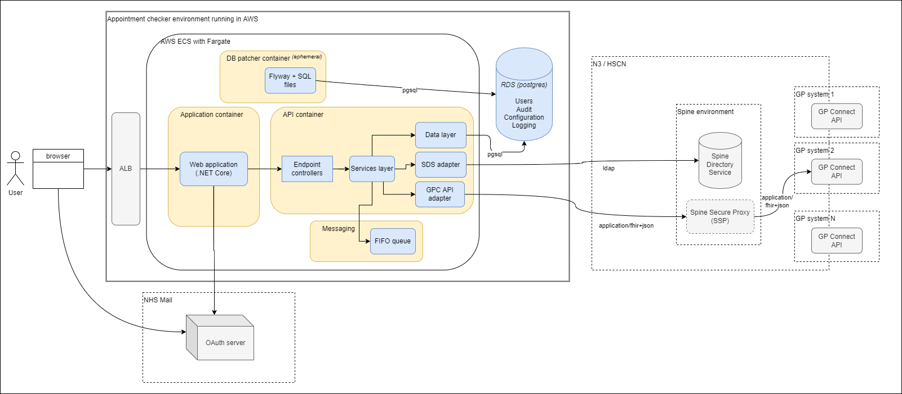

# GP Connect Appointment Checker

The GP Connect Appointment Checker is a web application for GP practice and operational support staff to view free appointment slots in a GP practice's appointment book that are available to book via the GP Connect API.

## Tech stack

  - .NET Core 3.1
    - Razor pages
    - hosted within Docker
  - Postgresql 11
    - patched with Flyaway 6.5.5
  - NHS UK frontend
  - NHS Mail authenication
  - Built according to progressive enhancement

## High level architecture

## Building

[TBC]

## Links

- [GP Connect API 1.2.7](https://developer.nhs.uk/apis/gpconnect-1-2-7/)
  - GP connect API calls
    - [Search for free slots](https://developer.nhs.uk/apis/gpconnect-1-2-7/appointments_use_case_search_for_free_slots.html)
    - [Get the FHIR capability statement](https://developer.nhs.uk/apis/gpconnect-1-2-7/foundations_use_case_get_the_fhir_capability_statement.html)
  - Spine integration
    - [Overview](https://developer.nhs.uk/apis/gpconnect-1-2-7/integration_illustrated.html)
    - [Creating the audit JWT](https://developer.nhs.uk/apis/gpconnect-1-2-7/integration_cross_organisation_audit_and_provenance.html)
    - [Spine Directory Service (SDS)](https://developer.nhs.uk/apis/gpconnect-1-2-7/integration_spine_directory_service.html)
    - [Spine Secure Proxy (SSP)](https://developer.nhs.uk/apis/gpconnect-1-2-7/integration_spine_secure_proxy.html)
- [NHS Mail sign sign on integration guide](https://s3-eu-west-1.amazonaws.com/comms-mat/Comms-Archive/NHSmail+Single+Sign-on+Technical+Guidance.pdf)
- [NHS UK frontend](https://github.com/nhsuk/nhsuk-frontend)
- [GOV.UK service manual - technology](https://www.gov.uk/service-manual/technology)
  - [Progressive enhancement](https://www.gov.uk/service-manual/technology/using-progressive-enhancement)
