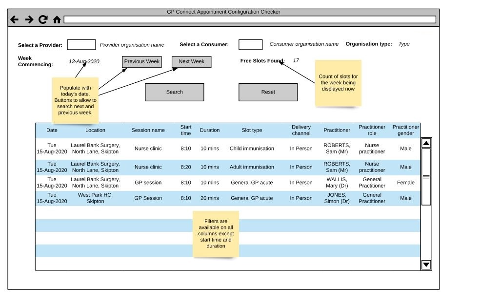

# GP Connect Appointment Configuration Checker

The GP Connect Appointment Configuration Checker is a web application for GP practice and operational support staff to view free appointment slots in a GP practice's appointment book that are available to book via the GP Connect API.

## Tech stack

  - .NET Core 3.1
    - Razor pages
    - Docker
  - Postgresql 11
    - Flyaway 6.5.5
  - [NHS UK frontend](https://github.com/nhsuk/nhsuk-frontend) styling
  - [NHS Mail authenication](https://s3-eu-west-1.amazonaws.com/comms-mat/Comms-Archive/NHSmail+Single+Sign-on+Technical+Guidance.pdf)
  - Built according to [progressive enhancement](https://www.gov.uk/service-manual/technology/using-progressive-enhancement)

## Building

[TBC]

## Links

[GP Connect API 1.2.7](https://developer.nhs.uk/apis/gpconnect-1-2-7/)
